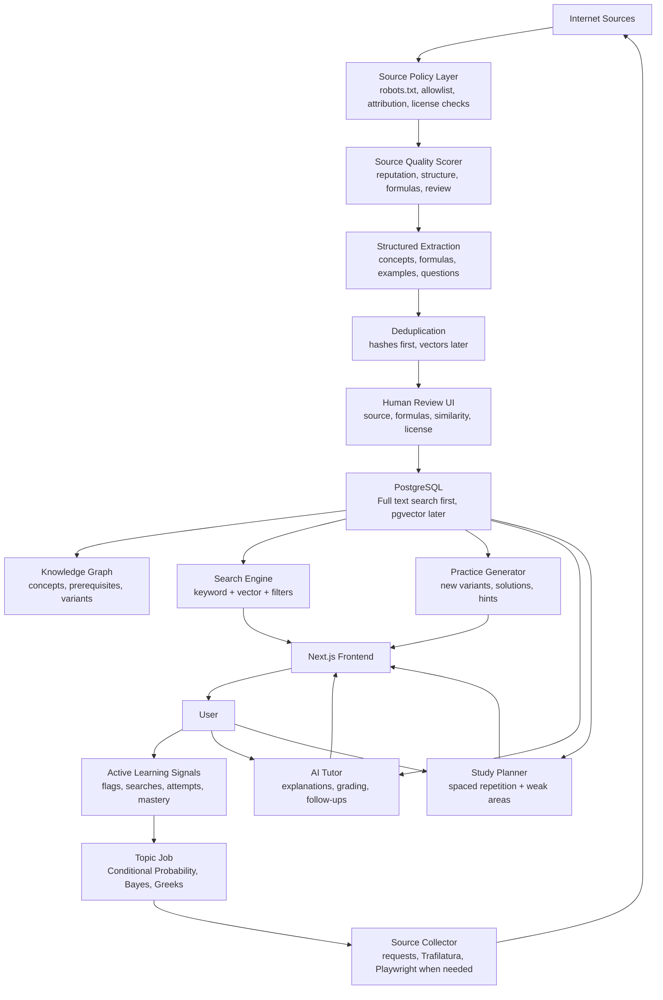

# Quant Prep AI

An AI-assisted quant interview prep website organized like LeetCode, with structured topics, searchable theory, practice problems, interactive market games, flashcards, and a topic-driven Knowledge Ingestion Pipeline.

## Product Goal

Build a study platform that helps users prepare for quant interviews across probability, math, coding, finance, mental math, statistics, market games, and behavioral questions.

The system should:

- Collect and organize public learning resources.
- Extract structured concepts, formulas, examples, and practice questions.
- Generate new practice variants instead of copying proprietary question banks.
- Provide AI explanations, hints, grading, flashcards, and study plans.
- Track user weaknesses and adapt difficulty over time.

## MVP Constraints

The initial MVP should be:

- Single-user.
- Local development only.
- Free to run locally.
- No authentication.
- No hosted deployment requirement.
- No paid AI APIs by default.
- No paid crawler services.
- No vector embeddings until there is enough approved content to justify them.

Use Ollama as the default AI provider behind an `AIProvider` interface. Route chat workloads by task (`tutor`, `coding`, `reasoning`) with small local defaults and documented production targets (Qwen3 32B, Qwen2.5-Coder 32B, DeepSeek-R1). Prefer JSON Schema structured outputs with validation and repair. OpenAI, Anthropic, and other providers can be added later as adapters.

Use PostgreSQL Full Text Search, hash-based duplicate detection, and normalized text comparison during the MVP. Add local embeddings and pgvector later.

Every AI request should record provider, model, token usage when available, latency, estimated cost, and cache hit/miss. Every background ingestion job should record start time, finish time, runtime, failure reason, source URL, model used, token usage, and estimated cost when applicable.

## Core Knowledge Hierarchy

The site should use a deep topic tree instead of a flat list. This is the foundation for search, recommendations, learning paths, ingestion classification, and AI tutoring.

### Probability

- Counting
- Conditional Probability
- Bayes
- Random Variables
- Expectation
- Variance
- Independence
- Continuous Distributions
- Markov Chains
- Martingales

### Mathematics

- Linear Algebra
- Calculus
- Optimization
- Differential Equations

### Statistics

- Estimation
- Hypothesis Testing
- Regression
- Maximum Likelihood
- Confidence Intervals

### Finance

- Derivatives
- Black-Scholes
- Greeks
- Portfolio Theory
- CAPM
- Fixed Income
- Market Microstructure

### Programming

- Python
- C++
- SQL
- Algorithms
- Data Structures
- Coding Patterns

### Coding Patterns

- Sliding Window
- Binary Search
- Prefix Sum
- Union Find
- Sweep Line
- Greedy
- Dynamic Programming
- Graph Traversal
- Intervals
- Two Pointers

### Mental Math

- Arithmetic
- Fractions
- Percentages
- Approximations
- Logarithms
- Roots
- Powers
- Expected Value
- Fast Estimation

### Quant Research

- Time Series
- Stochastic Processes
- Brownian Motion
- Monte Carlo
- Optimization
- Numerical Methods
- Machine Learning for Finance

### Other Sections

- Brain Teasers
- Game Theory
- Market Games
- Behavioral
- System Design
- Behavior Questions

Each section should support:

- Concept Pages
- Practice Problems
- Solutions
- Difficulty
- Tags
- Company Frequency
- AI Explanation
- Flashcards
- Similar Question Generation
- Review Scheduling

## Learning Paths

Users should not have to browse randomly. Learning paths give the site a beginner-friendly progression and give the AI planner a curriculum to follow.

Example path: Probability Foundations

1. Counting
2. Conditional Probability
3. Bayes
4. Expectation
5. Variance
6. Random Variables
7. Markov Chains

Other useful paths:

- Mental Math for Trading Interviews
- Coding Patterns for Quant SWE
- Options and Market Making
- Statistics for Quant Research
- Time Series and Stochastic Processes

## Concept Pages

Every important concept should have a mini-textbook page connected to practice.

Concept page structure:

- Definition
- Formula
- Intuition
- Worked examples
- Common mistakes
- Interview tips
- Practice questions
- Flashcards
- Prerequisites
- Related concepts
- Knowledge graph neighbors

Example: Bayes' Rule

- Prerequisites: Conditional Probability, Independence
- Related: Base Rates, Total Probability, Random Variables
- Common mistake: treating `P(A | B)` and `P(B | A)` as interchangeable
- Interview tip: define the event space before writing the formula

## Knowledge Graph

Add a first-class knowledge graph that connects topics, subtopics, formulas, question patterns, and user mastery.

Example:

```text
Conditional Probability -> Bayes -> Random Variables -> Expectation -> Markov Chains
```

The AI tutor and planner can use this graph to explain weaknesses:

> You struggle with Bayes because Conditional Probability mastery is only 42%.

The graph should power:

- Related concept recommendations
- Prerequisite warnings
- Study-path generation
- Question sequencing
- Ingestion classification
- Weakness diagnosis

## Knowledge Ingestion Pipeline

Do not frame this as a crawler. The crawler is only one tool inside a larger AI system.

The pipeline should crawl topics, not websites.

Example topic job: Conditional Probability

1. Collect 20-50 candidate sources.
2. Score source quality before storing content.
3. Extract definitions, formulas, examples, and candidate questions.
4. Generate original question variants.
5. Build flashcards.
6. Link concepts to prerequisites and related ideas.
7. Deduplicate with normalized text and hashes during the MVP.
8. Send structured drafts to human review.
9. Publish approved objects into the knowledge graph.

This produces a learning graph rather than a pile of pages.

### Source Quality Scoring

Every source should receive a `quality_score` before content is promoted.

| Signal | Weight |
| --- | ---: |
| Domain reputation | 25% |
| Content length | 10% |
| Math/formula density | 15% |
| Code examples | 10% |
| Educational structure | 20% |
| Human review rating | 20% |

Use `quality_score` to prioritize extraction, review, and ranking.

### Structured Extraction

The pipeline should output typed objects, not raw text.

Example extraction schema:

```json
{
  "topic_job": "conditional-probability",
  "resource": {
    "url": "https://example.com/conditional-probability",
    "title": "Conditional Probability Examples",
    "license": "unknown",
    "quality_score": 0.82
  },
  "concepts": [
    {
      "name": "Conditional Probability",
      "definition": "Probability of an event given that another event occurred.",
      "formula": "P(A | B) = P(A and B) / P(B)",
      "prerequisites": ["Sample Spaces", "Independence"]
    }
  ],
  "formulas": [
    {
      "latex": "P(A \\mid B) = \\frac{P(A \\cap B)}{P(B)}",
      "variables": ["A", "B"],
      "concept": "Conditional Probability"
    }
  ],
  "candidate_questions": [
    {
      "body": "Two fair coins are flipped. Given at least one is heads, what is the probability both are heads?",
      "difficulty": "medium",
      "subtopics": ["Conditional Probability"],
      "common_mistakes": ["Using 1/2 instead of changing the sample space"]
    }
  ],
  "flashcards": [
    {
      "front": "What is conditional probability?",
      "back": "The probability of A after observing B, written P(A | B)."
    }
  ]
}
```

### Semantic Deduplication

Exact hashing is not enough. These are the same question:

- What is the probability of exactly 7 heads in 10 coin flips?
- You toss 10 fair coins. Find the chance of obtaining 7 heads.

During the MVP, use normalized text comparison and hashes to detect duplicates. After the approved dataset is large enough, add local embeddings and pgvector to cluster near-duplicates. Keep one canonical question and store variants as aliases or generated alternatives.

### Human Review UI

The review queue is where quality is won or lost. Treat it as a first-class product feature.

The review screen should show:

- Original source
- Extracted text
- AI-generated summary
- Detected formulas
- Candidate questions
- Similarity score to existing questions
- Copyright/license status
- Source quality score
- Provenance metadata
- Approve / Edit / Reject actions

### Provenance Tracking

Every object should remember where it came from.

For every question store:

| Field | Purpose |
| --- | --- |
| source_url | Attribution |
| source_title | Traceability |
| source_license | Copyright safety |
| extraction_method | Debugging |
| model_version | Reproducibility |
| generated_from | Link generated variants to originals |

### Active Learning

The pipeline should improve from user behavior.

Examples:

- Questions with high completion rates get promoted.
- Questions frequently flagged as confusing return to review.
- Topics users search for but cannot find create new topic jobs.
- Weak areas across users trigger more content generation.

### Event-Driven Jobs

Use small, retryable stages instead of one giant crawler.

Recommended event stages:

1. `TopicJobCreated`
2. `CandidateSourcesFound`
3. `SourcePolicyChecked`
4. `SourceQualityScored`
5. `ResourceExtracted`
6. `StructuredObjectsExtracted`
7. `EmbeddingsCreated`
8. `SemanticDuplicatesClustered`
9. `HumanReviewRequested`
10. `KnowledgeObjectsPublished`
11. `LearningSignalsRecorded`

## Optimized Architecture



## Recommended Build Strategy

### Phase 1: Manual Seeded MVP

Do not start with a fully autonomous ingestion system. Start with a curated database and polished practice loop.

Build:

- Section/topic pages.
- Question browser with filters.
- Practice mode.
- AI explanation panel.
- Mental math grader.
- Flashcards.
- Progress tracking.
- Admin upload/import page for resources.

Why: ingestion is powerful, but the product lives or dies on clean questions, good explanations, and a fast practice experience.

### Phase 2: Assisted Ingestion

Add a topic-driven ingestion pipeline that drafts structured knowledge, but requires approval before publishing.

Pipeline:

1. Create a topic job.
2. Collect candidate sources.
3. Check policy, terms, and attribution requirements.
4. Score source quality.
5. Extract structured concepts, formulas, examples, questions, and flashcards.
6. Run hash-based and normalized-text duplicate detection.
7. Cluster semantic duplicates later when embeddings are added.
8. Store drafts with provenance.
9. Review in admin UI.
10. Publish approved knowledge objects.

### Phase 3: Adaptive AI Practice

Add:

- Personalized weak-topic detection.
- Daily study planner.
- Similar-question generator.
- AI interviewer mode.
- Timed interview simulations.
- Jane Street-style market games.

### Phase 4: Interactive Games

Prioritize games that can be evaluated deterministically:

- Guess 2/3 of the average.
- Monty Hall.
- Secretary problem.
- Auction games.
- Coin EV games.
- Market making spread game.
- Order book simulation.
- Card probability games.

## Tech Stack

### Frontend

- Next.js
- React
- TypeScript
- Tailwind CSS
- shadcn/ui
- TanStack Query
- Zustand or Jotai for local interaction state

### Backend

Recommended first choice: FastAPI.

Reasons:

- Python has better crawler, PDF, AI, and data-processing libraries.
- Easier integration with LangGraph and document parsers.
- Good fit for async ingestion jobs.

Use:

- FastAPI
- SQLAlchemy or SQLModel
- Alembic
- Pydantic
- Celery or Dramatiq for background jobs
- Redis for queues/cache

### Database

- PostgreSQL
- Full-text search indexes
- pgvector later, after the approved dataset is large enough
- Optional later: OpenSearch or Meilisearch if search grows complex

### AI

- Ollama as the default local provider
- `AIProvider` interface for future OpenAI, Anthropic, or other adapters
- Task-based model routing: tutor / coding / reasoning / embedding
- Production targets: Qwen3 32B, Qwen2.5-Coder 32B, DeepSeek-R1, `nomic-embed-text`
- Local defaults via `OLLAMA_CHAT_MODEL` (for example `qwen2.5:3b`) with optional `OLLAMA_MODEL_*` overrides
- JSON Schema structured outputs, Pydantic validation, and JSON repair retries
- Structured outputs for classification and extraction
- Cached AI outputs for summaries, explanations, and generated questions
- LangGraph later if multi-step workflows become complex

### Ingestion and Processing

- requests for simple page fetching
- Playwright for dynamic pages
- BeautifulSoup for targeted parsing
- Trafilatura for article extraction
- PyMuPDF or pypdf for PDFs
- Unstructured or Docling if PDF layouts get complex
- Firecrawl only as a later evaluation if local tools are insufficient

## Data Model

### Topic

- id
- slug
- name
- parent_topic_id
- description
- order_index

### Resource

- id
- source_type: url, pdf, book_note, manual, generated
- url
- title
- author
- publisher
- license
- attribution
- domain_reputation_score
- content_length_score
- formula_density_score
- code_example_score
- educational_structure_score
- human_review_score
- quality_score
- raw_text_hash
- summary
- status: draft, approved, rejected
- created_at
- updated_at

### Question

- id
- title
- body
- canonical_solution
- short_answer
- difficulty: easy, medium, hard, expert
- estimated_time_seconds
- source_id
- source_url
- source_title
- source_license
- extraction_method
- model_version
- generated_from
- source_attribution
- topic_id
- subtopic_id
- company_hint
- frequency_score
- quality_score
- expected_solution_pattern
- common_mistakes
- prerequisites
- related_question_ids
- status: draft, approved, rejected
- embedding
- created_at
- updated_at

### TopicJob

- id
- topic_id
- concept_id
- query
- target_source_count
- status: queued, collecting, extracting, reviewing, completed, failed
- priority
- created_by: user, admin, active_learning
- created_at
- updated_at

### ExtractedObject

- id
- resource_id
- topic_job_id
- object_type: concept, formula, example, question, flashcard
- payload_json
- confidence_score
- quality_score
- duplicate_cluster_id
- status: draft, approved, rejected
- extraction_method
- model_version

### DuplicateCluster

- id
- object_type
- canonical_object_id
- similarity_threshold
- representative_embedding
- created_at

### LearningSignal

- id
- user_id
- signal_type: search_miss, confusing_question_flag, high_completion_rate, weak_topic
- topic_id
- question_id
- payload_json
- created_at

### Concept

- id
- slug
- name
- topic_id
- definition
- formula
- intuition
- common_mistakes
- interview_tips
- prerequisites
- embedding

### ConceptEdge

- id
- source_concept_id
- target_concept_id
- relationship_type: prerequisite, related, unlocks, commonly_confused_with
- weight

### LearningPath

- id
- slug
- name
- description
- target_user_level
- estimated_hours

### LearningPathStep

- id
- learning_path_id
- concept_id
- order_index
- required_mastery_score

### Tag

- id
- slug
- name
- category: concept, company, format, skill, formula

### QuestionTag

- question_id
- tag_id

### Flashcard

- id
- front
- back
- topic_id
- source_id
- difficulty
- embedding

### Attempt

- id
- user_id
- question_id
- answer
- is_correct
- score
- feedback
- time_spent_seconds
- created_at

### UserTopicMastery

- user_id
- topic_id
- mastery_score
- attempts_count
- last_practiced_at
- next_review_at

## Ingestion Guardrails

This project should not become a scraper that republishes other websites.

Use the ingestion pipeline to:

- Index metadata and source links.
- Summarize concepts.
- Extract short educational snippets when allowed.
- Generate original practice variants.
- Build flashcards from permitted material.
- Preserve attribution.

Avoid:

- Copying entire proprietary question banks.
- Republishing paid book content.
- Ignoring robots.txt or site terms.
- Storing long copyrighted passages without permission.
- Presenting AI-generated questions as if they came from a company.

Best practice:

- Keep an allowlist of sources.
- Check robots.txt and terms.
- Store provenance for every item.
- Keep copyrighted source text in private draft form only when permitted.
- Publish original rewritten/generated questions with source-inspired concept attribution.
- Add a human review step before publishing.

## Agent Design

### Topic Job Planner

Input:

- Topic or concept, target depth, source count, user demand signals.

Output:

- Topic-driven ingestion job.
- Source query plan.
- Prerequisite concepts to link.

### Source Collector

Input:

- Topic job and source queries.

Output:

- Candidate URLs, PDFs, and references.
- Source metadata.
- Policy check status.
- Quality score draft.

### Source Quality Scorer

Input:

- Source metadata and extracted page features.

Output:

- Domain reputation score.
- Content length score.
- Formula density score.
- Code example score.
- Educational structure score.
- Overall quality score.

### Resource Summarizer

Input:

- PDF, blog, notes, or extracted page.

Output:

- Topic map.
- Definitions.
- Important formulas.
- Example problems.
- Flashcards.
- Summary.

### Question Extractor

Input:

- Clean text chunks.

Output:

- Candidate questions.
- Candidate answers.
- Difficulty.
- Topic.
- Tags.
- Source attribution.

### Semantic Deduper

Input:

- Extracted questions, generated variants, existing approved records.

Output:

- Hash and normalized-text duplicate matches during the MVP.
- Canonical question recommendation.
- Similarity score when embeddings are added later.
- Variant links.

### Question Generator

Input:

- Topic, concept, difficulty, style.

Output:

- Original practice questions.
- Solutions.
- Hints.
- Common mistakes.
- Similar variants.

### AI Tutor

Input:

- Question, user answer, solution, user history.

Output:

- Feedback.
- Diagnosis.
- Hint.
- Step-by-step explanation.
- Follow-up question.

### Study Planner

Input:

- User mastery scores, upcoming goals, available time.

Output:

- Daily plan.
- Review queue.
- Difficulty mix.
- Estimated time.

### Active Learning Agent

Input:

- Search misses, question flags, attempt outcomes, mastery trends.

Output:

- New topic jobs.
- Review recommendations.
- Content generation priorities.
- Question promotion/demotion signals.

## MVP Feature Set

The first useful version should include:

- Home dashboard with daily plan.
- Topic library.
- Question bank with filters.
- Practice session mode.
- AI explanation and hint panel.
- Mental math drill mode.
- Flashcards.
- Admin import page.
- Draft review queue for ingested/generated content.

Skip until later:

- Voice interviews.
- Fully autonomous ingestion.
- Complex multiplayer market games.
- Custom search infrastructure beyond PostgreSQL.
- Mobile app.

## Example Practice Flow

1. User selects Probability.
2. User filters by Conditional Probability and Medium.
3. User answers a question.
4. AI grades the response.
5. AI explains the core mistake.
6. User requests a similar question.
7. System records mastery impact.
8. Planner schedules future review.

## Example Prompt Contracts

### Classification Output

```json
{
  "section": "Probability",
  "topic": "Combinatorics",
  "difficulty": "Medium",
  "tags": ["binomial", "coin-flips", "counting"],
  "company_hints": [],
  "is_interview_question": true,
  "quality_score": 0.86
}
```

### Generated Question Output

```json
{
  "title": "Exactly 7 Heads",
  "body": "You flip 10 fair coins. What is the probability of exactly 7 heads?",
  "answer": "120 / 1024 = 15 / 128",
  "solution": "Choose which 7 of the 10 flips are heads: C(10, 7). Each exact sequence has probability (1/2)^10. So the probability is C(10, 7) / 2^10 = 120 / 1024 = 15 / 128.",
  "difficulty": "Easy",
  "tags": ["binomial", "combinatorics", "coin-flips"]
}
```

## Initial Source List

Candidate sources to evaluate manually before ingestion:

- https://algomaster.io
- https://www.quantguide.io/questions
- https://www.puzzledquant.com
- https://quantquestions.io/problems
- https://openquant.co/questions
- https://www.tradinginterview.com/interview-questions/
- https://www.tradinginterview.com/market-making-games/
- Green Book: A Practical Guide to Quantitative Finance Interviews

For books, prefer manually entered notes, summaries, formulas, and original practice variants. Do not bulk-copy book questions unless licensing permits it.

## First Implementation Milestone

Create a web app with:

- `/` dashboard
- `/topics`
- `/topics/[slug]`
- `/practice`
- `/mental-math`
- `/flashcards`
- `/admin/import`
- `/admin/review`

Seed it with a small hand-authored dataset:

- 20 probability questions
- 20 mental math questions
- 10 coding concept prompts
- 10 finance questions
- 5 market games

Then add ingestion and AI features around that stable core.
