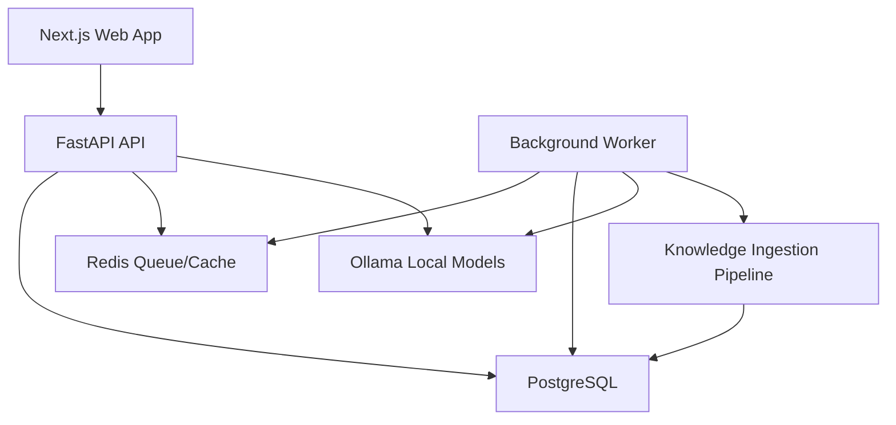

# Quant Prep AI Architecture

This document captures the pre-implementation architecture direction. It should be reviewed with `docs/product-roadmap.md` before Phase 0 begins.

## Core Principles

- Build a single-user local MVP first.
- Do not implement authentication in the MVP.
- Keep local development completely free.
- Use deterministic code before AI.
- Use AI only for tasks that require language understanding or generation.
- Cache every AI-generated result.
- Prefer offline/background AI jobs over request-time generation.
- Avoid paid crawler services in the MVP.
- Delay embeddings until the dataset is large enough to need semantic search.
- Keep all AI providers behind an interface.
- Treat ingestion as a Knowledge Ingestion Pipeline, not a scraper.

## Initial Architecture



## Local-First MVP

The MVP should run locally without paid services.

Required local services:

- Next.js frontend
- FastAPI backend
- Background worker
- PostgreSQL
- Redis
- Ollama

Not included in MVP:

- Authentication
- Hosted deployment
- Paid crawler services
- Paid AI APIs
- Vector embeddings
- pgvector
- Multiplayer or collaborative features

## AI Provider Design

All model calls must go through an `AIProvider` abstraction.

Default provider:

- Ollama

### Task-based model routing

Route requests by workload instead of using one model for everything:

```text
User / API
   │
AI Router (AITask)
   ├── general    → general tutoring, lessons, quizzes, similar questions
   ├── coding     → Java/Python/SQL, LeetCode-style help, debugging
   ├── reasoning  → quant interview problems, multi-step math
   └── embedding  → semantic search over learning content (deferred to QP-048)
```

Production Ollama targets:

| Task | Env override | Model |
| --- | --- | --- |
| general | `OLLAMA_MODEL_GENERAL` | Qwen3 32B (`qwen3:32b`) |
| coding | `OLLAMA_MODEL_CODING` | Qwen2.5-Coder 32B (`qwen2.5-coder:32b`) |
| reasoning | `OLLAMA_MODEL_REASONING` | DeepSeek-R1 (`deepseek-r1`) |
| embedding | `OLLAMA_EMBEDDING_MODEL` | `nomic-embed-text` |

Local MVP defaults stay small and pullable. `OLLAMA_CHAT_MODEL` is the fallback for every chat task when a specialized `OLLAMA_MODEL_*` override is empty. A practical local starting point is `qwen2.5:3b` (or larger quantized stand-ins when hardware allows).

If you can only run one chat model, use the general model and leave coding/reasoning overrides blank so they fall back.

### Performance defaults

- Keep prompts short; generate only the fields the current UI action needs (hints vs explanation).
- Prefer JSON Schema constrained generation and schema validation.
- Keep `AI_JSON_REPAIR_ATTEMPTS=0` once outputs are stable (fail fast).
- Cache by provider, model, prompt hash, template/schema version, and input object version.
- Warm the default chat model on API startup (`AI_WARMUP_ON_STARTUP`).
- Response streaming is deferred (next performance pass).
- Parallel multi-artifact generation is deferred until lesson/quiz/flashcard AI jobs exist.

### Structured outputs

- Prefer JSON Schema constrained generation (`format: <schema>` via Ollama) over free-form "return JSON" prompts.
- Validate every response against the Pydantic/app schema.
- Optional JSON repair retries remain configurable via `AI_JSON_REPAIR_ATTEMPTS` (default `0`).

Possible later providers:

- OpenAI
- Anthropic
- Google

Every AI request must record:

- Provider
- Model
- Input tokens, when available
- Output tokens, when available
- Latency
- Estimated cost
- Cache hit or miss
- Prompt hash
- Input object version
- Created timestamp

Use AI for:

- Explanations
- Hints
- Summarization
- Concept extraction
- Question generation
- Classification

Do not use AI for:

- Deterministic math grading
- Flashcard scheduling
- Progress tracking
- Filtering
- Search
- Hash-based duplicate detection

## AI Caching

Every AI-generated result should be cached by:

- Provider
- Model
- Prompt template version
- Input hash
- Relevant object version

Cached objects:

- Explanations
- Hints
- Summaries
- Generated question variants
- Structured extraction outputs
- Classification outputs

The UI should not regenerate AI output unless explicitly requested.

## Search and Deduplication Strategy

MVP search:

- PostgreSQL Full Text Search
- Filters by topic, concept, difficulty, tags, and metadata

MVP deduplication:

- Raw text hash
- Normalized text hash
- Normalized string comparison

Later search:

- Local embeddings
- pgvector
- Hybrid full text + vector ranking

Later deduplication:

- Embedding similarity
- Duplicate clusters
- Canonical record suggestions

## Knowledge Graph

The knowledge graph is a first-class learning primitive.

Core models:

- `Concept`
- `ConceptEdge`

Supported relationship types:

- `requires`
- `related_to`
- `used_in`

Primary uses:

- Concept page related links
- Prerequisite warnings
- Study path sequencing
- AI tutor context
- Weakness diagnosis
- Ingestion classification

Example:

```text
Conditional Probability --requires--> Counting
Bayes --requires--> Conditional Probability
Bayes --related_to--> Base Rates
Bayes --used_in--> Medical Testing Problems
```

## Knowledge Ingestion Pipeline

The pipeline is topic-driven.

Example input:

```text
Topic job: Conditional Probability
```

Pipeline stages:

1. Create topic job.
2. Collect candidate sources.
3. Check source policy.
4. Score source quality.
5. Extract content locally.
6. Use AI for structured extraction only when needed.
7. Store extracted typed objects.
8. Detect duplicates with normalized text.
9. Send drafts to human review.
10. Publish approved knowledge objects.

MVP crawler tools:

- requests
- BeautifulSoup
- Trafilatura
- Playwright only when needed
- PyMuPDF for PDFs

Do not use Firecrawl in the MVP.

## Ingestion Observability

Every ingestion and background job must log:

- Job ID
- Stage
- Start time
- Finish time
- Runtime
- Status
- Failure reason
- Source URL, when applicable
- Model used, when applicable
- Token usage, when applicable
- Estimated cost, when applicable

This applies to:

- Topic jobs
- Source collection
- Source scoring
- Page extraction
- PDF extraction
- Structured AI extraction
- AI generation
- Draft publishing

## Data Model Areas

Learning core:

- Topic
- Concept
- ConceptEdge
- Question
- Tag
- QuestionTag
- Flashcard
- LearningPath
- LearningPathStep
- Attempt
- UserTopicMastery

Ingestion:

- TopicJob
- Resource
- ExtractedObject
- JobExecutionLog
- LearningSignal

AI:

- AIUsageLog
- AICacheEntry

Later vector search:

- Embedding provider metadata
- Vector columns
- DuplicateCluster

## API Areas

MVP APIs:

- Topics
- Concepts
- Questions
- Flashcards
- Learning paths
- Search
- Attempts

Phase 3A APIs:

- AI explanations
- AI hints
- Similar question generation

Phase 3B APIs:

- Mastery
- Spaced repetition
- Study planner
- Learning analytics

Phase 4-5 APIs:

- Admin import (question/flashcard drafts with user-selected topic)
- Review queue (edit draft, approve, publish)
- Topic jobs
- Ingestion job status

Phase 4 admin scope:

- Import → `ExtractedObject` draft → human review → publish as `Question` or `Flashcard`.
- User picks topic/subtopic at import and in review (`ADR-013`).
- URL/PDF AI extraction deferred to Phase 5 `QP-042` / `QP-043` (`ADR-014`).
- Phase 4 PDF import uploads and stores files; extraction is Phase 5.
- Phase 5 must use AI to turn long page text, PDF text, and pasted notes into formatted question/answer (and flashcard) review drafts (`QP-043`).
- Editing existing `Concept` records is separate (`QP-038`); manual import does not create concepts (`ADR-012`).

No authentication should be added until a later milestone.

## Frontend Routes

MVP routes:

- `/`
- `/topics`
- `/topics/[slug]`
- `/concepts/[slug]`
- `/practice`
- `/mental-math`
- `/flashcards`
- `/admin/import`
- `/admin/review`

Later routes:

- `/analytics`
- `/market-games`
- `/admin/ingestion/jobs`
- `/admin/concepts` (edit existing concepts, `QP-038`)
- `/settings`
- `/login`

## CI/CD Requirements

Phase 0 must include automated checks.

Backend:

- pytest
- ruff
- mypy
- coverage

Frontend:

- eslint
- prettier
- TypeScript type checking

Every PR should pass all checks before merging.

## Deferred Decisions

Authentication:

- Deferred until after local MVP feedback.
- Candidates: Auth.js or Clerk.

Deployment:

- Deferred until after MVP.

Paid AI providers:

- Deferred.
- Add through `AIProvider` adapters only.

Paid crawler services:

- Deferred.
- Evaluate only after local tooling proves insufficient.

Embeddings:

- Deferred until approved dataset size and search quality justify them (`QP-047`–`QP-051`).

Manual ingestion:

- Phase 4 publishes questions and flashcards only; no new concepts/topics via import (`ADR-012`).
- User assigns topic at import/review; AI topic suggestions start in Phase 5 (`ADR-013`).
- URL/PDF AI extraction deferred to Phase 5 (`ADR-014`).
- Phase 5 AI parsing (`QP-043`): long webpage/PDF/pasted text → formatted Q&A and flashcard drafts for human review.
- Existing concept editing is a separate admin workflow (`QP-038`).

